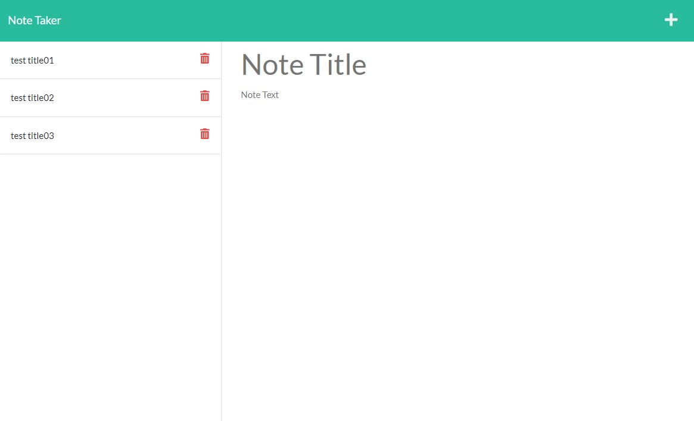

# Note Taker

## Description
We have here a webpage published on Heroku to use express.js to have a functional note taker for the busy professional. The information is stored and can be retrieved back even after leaving the site.

We used express.js and the various methods we can call upon to make the functions work.

This project was particularly difficult due to the naming convention confusing me during the composition of the code. After some trial and error with a different project, I was able to find a solution. In the future, I would like to be able to implement categories for the notes so they can be minimized in the side bar, edit the notes that are already saved, and have a feedback page for future development.

## Table of Contents
- [Example](#example)
- [Installation](#installation)
- [Usage](#usage)
- [License](#license)
- [Contributing](#contributing)
- [Tests](#tests)
- [Questions](#questions)

## Example
[Link](https://lit-harbor-77949.herokuapp.com/) to the webpage

## Installation
No installations are required, just to visit the webpage and start using it.

## Usage
The webpage is easily accessible making it very easy to take your notes anywhere. The design is simple making it easy on the eyes as well.

## License
Licensed under the [MIT](https://opensource.org/licenses/MIT) license.

## Contributing
Contribution inquiries can be sent through the Github or the email in the question section (although, I work full time with family obligations so replies may be slow). I am open to all suggestions.

## Tests
Tests were conducted using Insomnia for the request methods as well as trial and error for the front end.

## Credits
- [MDN Wed Docs](https://developer.mozilla.org/en-US/)
- [Stack Overflow](https://stackoverflow.com/)
- [Shields.io](https://shields.io/)
- [Github Gist: rxaviers](https://gist.github.com/rxaviers/7360908)

## Questions
Please contact me below for further questions:

:octocat: Github username: [LonelyMitoc](https://github.com/LonelyMitoc)

:e-mail: Email: jamesmatsu@gmail.com
